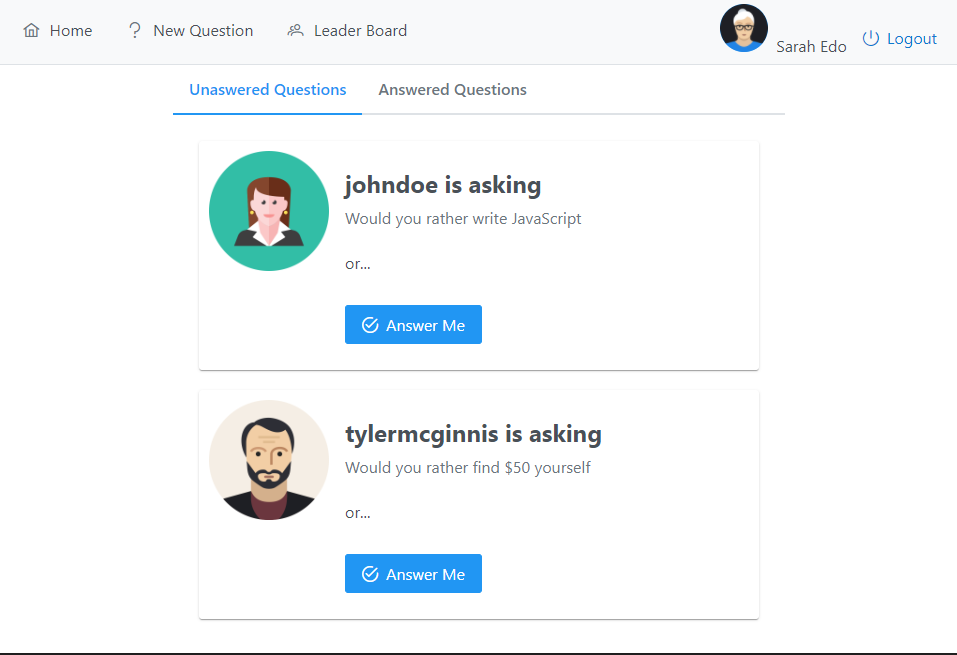

# Would You Rather Project

A game project that allows users to ask/answer questions with each other and the top 3 will be in the leader board.

This project uses react and redux as a state management.



## Project Set Up and Installation

use npm:

```
npm install
```

or just use yarn:

```
yarn
```

## Documentation

To run the project use commands as follow:

| Command    | Description                     |
| ---------- | ------------------------------- |
| yarn start | start the appliction            |
